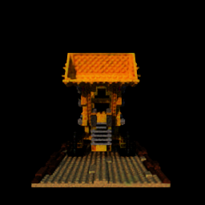
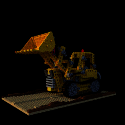
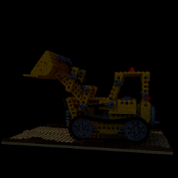
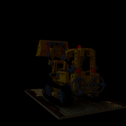
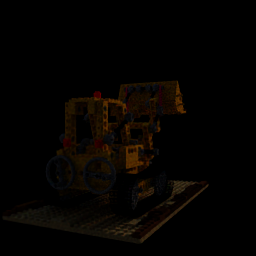
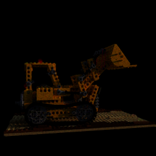

# LiteRF
implementation of various radiance fields in C++

# Build (CPU):

1. clone this repo:
   * git clone
   * cd LiteRF 
2. clone submodules:
   * git submodule init && git submodule update 
3. build enzyme AD like here https://github.com/Ray-Tracing-Systems/HydraCore3
4. use Cmake to build project:
   * mkdir cmake-build-release && cd cmake-build-release
   * cmake -DCMAKE_BUILD_TYPE=Release ..
   * make -j 8  
5. download data
   * download here https://drive.google.com/drive/u/0/folders/1-iJug5cTJA7bhDnhIxTraH5EyuyRA7sr
   * put it a data/radiance_fields folder

